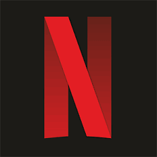

# Netflix Clone made with ReactJS

 &nbsp; 

In this build, the following was done:
- Use of React, React-Router, Redux and other useful libraries
- Login and Logout Authentication with Google Firebase
- Axios was used for fetching requests for the information of Movies and TV Shows
- Home Screen with a similar look to that of Netflix using TMDB API
- Profile Page with the user information and Plans (**Need to still create**)
- Firestore Database to store the User Data
- Firebase Hosting of this Web Application

*For the Plans section, I intend to use Stripe Payments Extension through Firebase.*

Current build can be accessed at: [Netflix-Clone](https://netflix-clone-teja.netlify.app/)

# Outputs:

# Note:
- For new users, they will need to type in Email and Password on the Sign-In Page. Then click on **Sign up now**. They will be directed to the Home Screen.
- For registered users, they can type in Email and Password on the Sign-In Page. Then click on **Sign In** button and they will be directed to the Home Screen.
